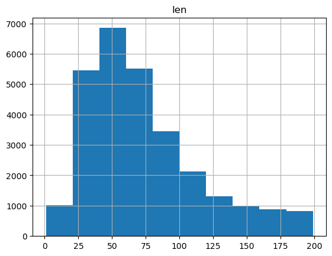
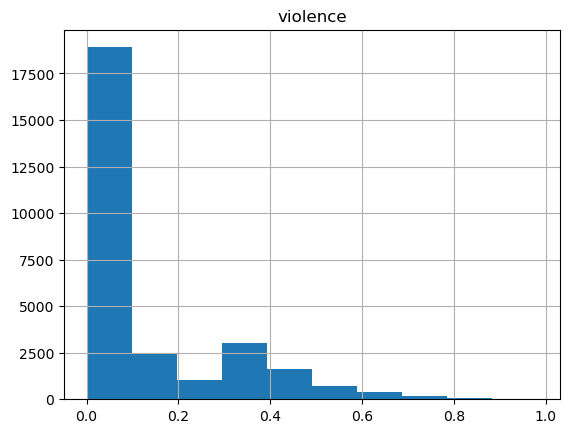
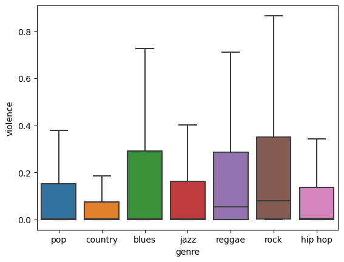
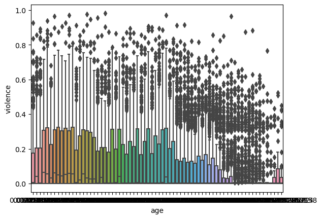
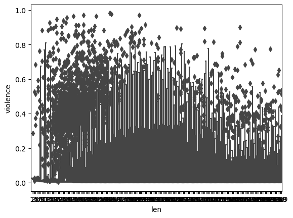
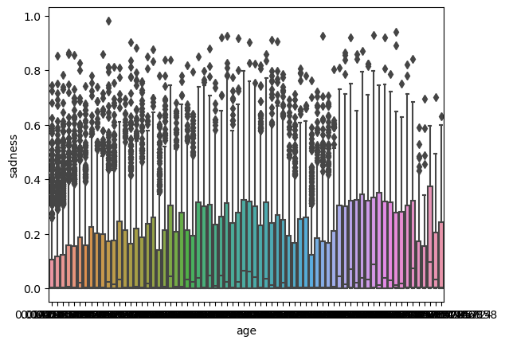
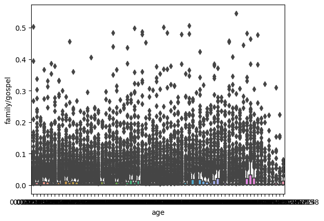
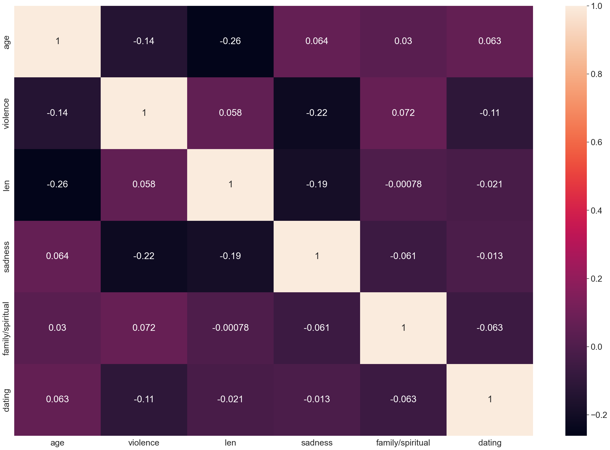
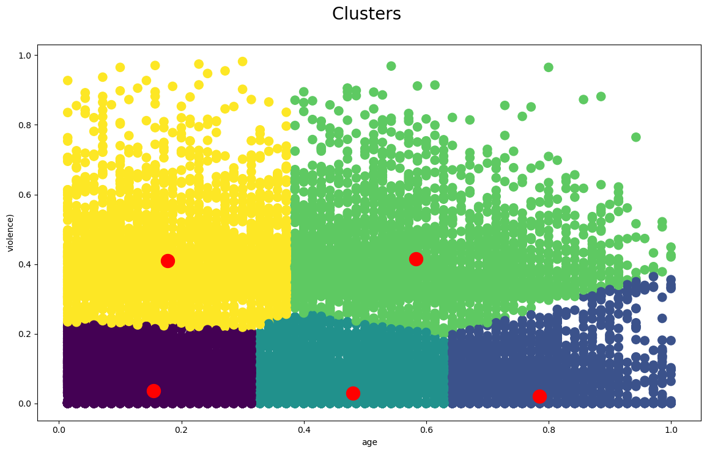
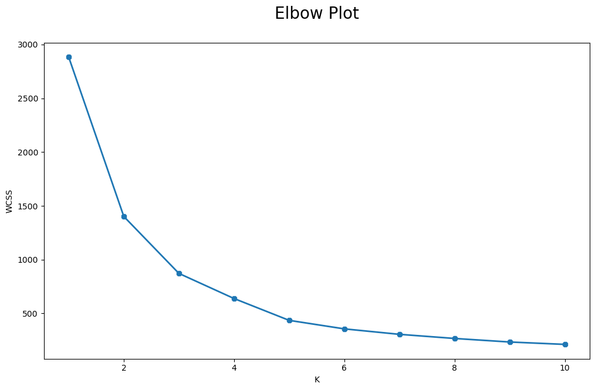

**Audio Recommendation Algorithm - Basic Project**

In this project, we delve into unsupervised learning applications within the realm of data science. Specifically, we aim to analyze a dataset of songs, focusing on their lyrical features, and potentially their lyrical content to discover clusters. The dataset we're working with spans from 1950 to 2011 and encompasses various attributes of songs, including artist name, track name, release date, genre, and several lyrical features.

The dataset columns include:

artist_name: Name of the artist
track_name: Name of the song
release_date: Release date of the song
genre: Categorical genre of the song
lyrics: Pre-tokenized lyrics of the song (note: may contain obscene content)
len: Number of words in the lyrics
dating: Likelihood of lyrics being related to dating
violence: Likelihood of lyrics being related to violence
world/life: Likelihood of lyrics being related to world/life topics
night/time: Likelihood of lyrics being related to night-life or time
shake the audience: Likelihood of lyrics being provocative
family/gospel: Likelihood of lyrics being related to family or gospel
romantic: Likelihood of lyrics being related to romantic feelings
communication: Likelihood of lyrics being related to communication
obscene: Likelihood of lyrics being obscene
music: Likelihood of lyrics being related to music
movement/places: Likelihood of lyrics being related to movement or places
light/visual perceptions: Likelihood of lyrics being related to light or visual perceptions
family/spiritual: Likelihood of lyrics being related to family or spirituality
sadness: Likelihood of lyrics being related to sadness
feelings: Likelihood of lyrics being related to emotions
topic: Categorical label of lyrical content
age: Score indicating the "oldness" of the song
Instructions

Project Objectives:
 This project involves creating a comprehensive machine learning pipeline following classic steps:

Initial EDA:

Conduct univariate, bivariate, and multivariate exploratory analysis.
Create relevant graphs to aid in hypothesis formulation.
Explore interactions between predictors creatively.

Data Cleaning, Pre-processing, and Dimensionality Reduction:
Clean and wrangle the dataset.
Handle null values, unnecessary columns, outliers, and format inconsistencies.
Consider dropping the "lyrics" column due to its nature.
Save the processed dataframe as a new CSV file.

Model Creation, Hyperparameter Search, and Model Evaluation:
Implement a clustering algorithm (e.g., KMeans) on the training dataset.
Evaluate the optimal number of clusters using suitable techniques.
Save cluster labels as a new column in the dataframe for further analysis.

New Sample Prediction:
Apply the trained model on a test dataset to generate cluster labels for new samples.
Save the cluster labels as a new column in the test dataframe for further analysis.

**Hypothesis:**

I hypothesize that newer song releases have more violent content in them.

**Observations**

Most of the gprahs showed a right skewed distrbution. 
This is the lenght and violence graph.
 

The genre of music that has the most violence in it is rock. Rock has the highest median compared to other genres. 

We find out that newer release songs have more violence in them as well.

I find out that music that are shorter in lenght have more violence in them.

Newly released songs have more saddening elements in them.

Older released songs are less likely to be about family and the gospel.

Heat maps was used for graphical representation. Heat maps provide a visual representation of data values in a matrix format, where each cell is assigned a color based on its numeric value. Heat maps are particularly useful for identifying patterns, trends, and relationships in large datasets.

There were 5 optimal numbers of clusters in my cluster model and this was discovered using the elbow plot.

Yellow cluster: between ages 0-0.37 has a high amount of violence in it.
Green cluster: between ages 0.37-1 has a high amount of violence in it and it encompasses a wider age range.
Dark Purple cluster: has low amount of violence and is between the age of 0-0.36.
Greenish-blue cluster: between age 0.36-0.63 has a low amount of violence.
Light purple: between 0.63- 1 has a wider age range and lower amount of violence.

**Conclusion:**

This project aims to leverage unsupervised learning techniques to uncover patterns within the dataset of songs, which can potentially lead to the development of an audio recommendation algorithm. By following the outlined structure and instructions, we aim to create a comprehensive pipeline that facilitates thorough exploration and analysis of the dataset.